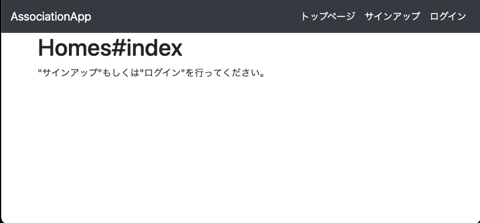
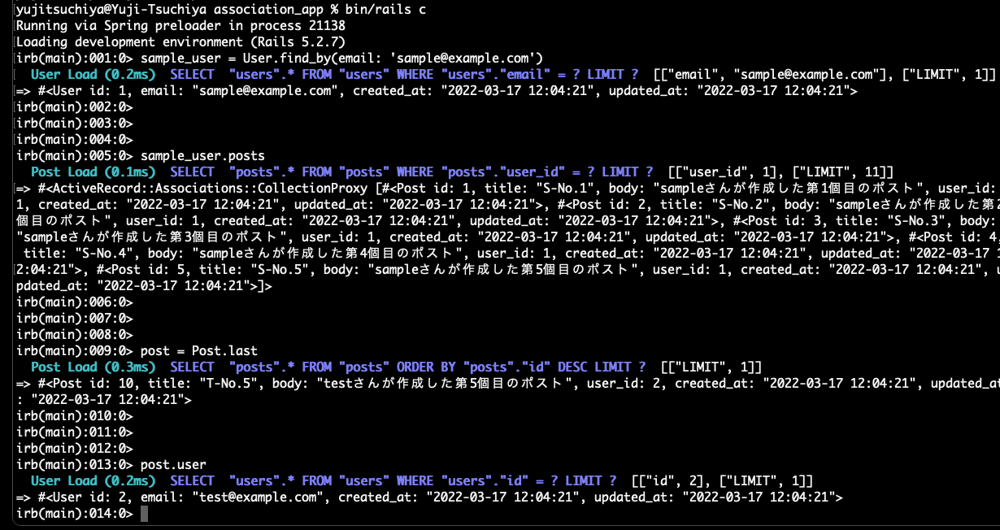

# アソシエーション(Association)

## 概要

Ruby on Rails のアソシエーションに関して、実際にコンソールを叩いてみてどんなものなのかを体験していただきます。

また、アソシエーション活用の有無によってどんなことを防ぐことができるのかを、実際にブラウザ操作を行ってもらい、理解を深めていきましょう！

（アソシエーションに関しては、`現場Rails p.168〜` や [Railsガイド](https://railsguides.jp/association_basics.html)を参照してみましょう！）

---

## セットアップ

Ruby：2.5.1

Rails：5.2.6

```bash
$ git clone git@github.com:Tsuchiya2/experience_association_app.git
$ cd experience_association_app
$ git remote rm origin
$ git checkout -b try_association
$ rbenv local 2.5.1
$ bundle install
$ bin/rails db:migrate
$ bin/rails db:seed
$ bin/rails s
```

サーバーを立ち上げて`http://localhost:3000/`にアクセスできればセットアップ完了です。

初期で準備されているUserデータ
```
sample
  - email: 'sample@example.com'
  - password: 'passwrod'

test
  - email: 'test@example.com'
  - password: 'password'
```



---

## Railsコンソールでアソシエーションを体験

まずはRailsコンソールを使ってアソシエーションを体験してみましょう。

```bash
$ bin/rails c
```

まずはsampleユーザーに紐付いているPostsの一覧を取得してみましょう。

```bash
$ irb(main):001:0> sample_user = User.find_by(email: 'sample@example.com')

$ irb(main):002:0> sample_user.posts
```

今度はPostsテーブルの最後に登録されているレコードを作成したユーザーを特定してみましょう。

```bash
$ irb(main):003:0> post = Post.last

$ irb(main):004:0> post.user
```



いかがですか？
以下のような手順を踏まなくても、ユーザーに紐付いたポストの一覧を取得できたり、ポストを投稿したユーザー情報を取得できたかと思います。

```ruby
# 仮にアソシエーションを使わずにデータを取得するとしたら。

# sample_user.posts を使わない場合
sample_user = User.find_by(email: 'sample@example.com')
Post.where(user_id: sample_user.id)

# post.user を使わない場合
post = Post.last
User.find(post.user_id)

# 記述量が少なく且つ比較的近くに関連の記述があるため、
# どんなデータを取得したいのかが分かり、アソシエーションの利点を感じにくいかもしれません。

# 例えば、コントローラーで取得した@posts(Post.all)に対して、
# 誰が投稿したものなのかをビューで表示させようとすると、
# どういう記載をする必要がありそうかを考えてみると、アソシエーションの利点を掴みやすくなるかもしれません。

# アソシエーションを活用すると、
# each文などを活用して1つ1つのレコードを表示されるようにした上で、「post.user.name」と書くと投稿者の名前を表示できるかと思います。
```

他にも[Railsガイド](https://railsguides.jp/association_basics.html#%E9%96%A2%E9%80%A3%E4%BB%98%E3%81%91%E3%81%AE%E8%A9%B3%E7%B4%B0%E6%83%85%E5%A0%B1)を参考にして試してみると、どんなことができるのかが体験できるので、時間のある際に試してみましょう！

（もしデータを削除してしまったりして初期状態に戻したい場合は、ターミナルで`bin/rails db:seed`を実行すると、ほぼ初期状態に戻せるようにしてありますのでお気軽に！）

---

## ブラウザでアソシエーションを体験

次はブラウザでアソシエーションを体験してみましょう。ターミナルでサーバー(`bin/rails s`)を立ち上げて、`http://localhost:3000`にアクセスしましょう。


Homes#Indexページを表示できたらヘッダーの`ログイン`をクリックし、以下どちらかでログインしましょう。

```
sample
  - email: 'sample@example.com'
  - password: 'passwrod'

test
  - email: 'test@example.com'
  - password: 'password'
```

ログインに成功すると、Homes#Indexページは↓の画像のように変わっているかと思います。


まずは`Post一覧`をクリックし、ログイン中のEmailと同じ"User Email"の投稿を更新・削除してみましょう。難なく投稿を更新・削除できたかと思います。


次にログイン中のEmailとは異なる"User Email"の投稿を更新・削除してみましょう。

どうでしょうか？更新を行うと"User Email"も変わってしまったり、他者の投稿を削除できてしまったのではないでしょうか？


（S-No.1のbodyを変更して更新・S-No.2を削除）

app/controllers/posts_controller.rbを確認すると、以下のようになっていますね。先程の`Railsコンソールでアソシエーションを体験`で使用したような記載はありませんよね。(例：post.user.email, user.posts, etc)


今度は`Task一覧`へ移動して、Postの時と同様の操作を行ってみましょう。ログインしている"User Email"以外のTaskを編集・削除しようとするとエラー画面が表示されるかと思います。(`current_user`はgem '[devise](https://github.com/heartcombo/devise)'で用意されているヘルパーメソッドで、現在ログインしているユーザーのレコードを取得できます)


app/controllers/tasks_controller.rbを確認すると以下のようになっていますね。


先程のapp/controllers/posts_controller.rbと比較すると、所々記載が異なっているかと思うので確認してみましょう。(new, create, set_task, task_paramsにおいて違いがあるかと思うので、何が違っているのか＆どんな挙動になるのかを考えてみましょう)

---

## 最後に

いかがでしたでしょうか？アソシエーションがどんなものなのか、少しでも理解の助けになったら嬉しいです。

最後まで取り組んでいただき、ありがとうございました🐱🐾
